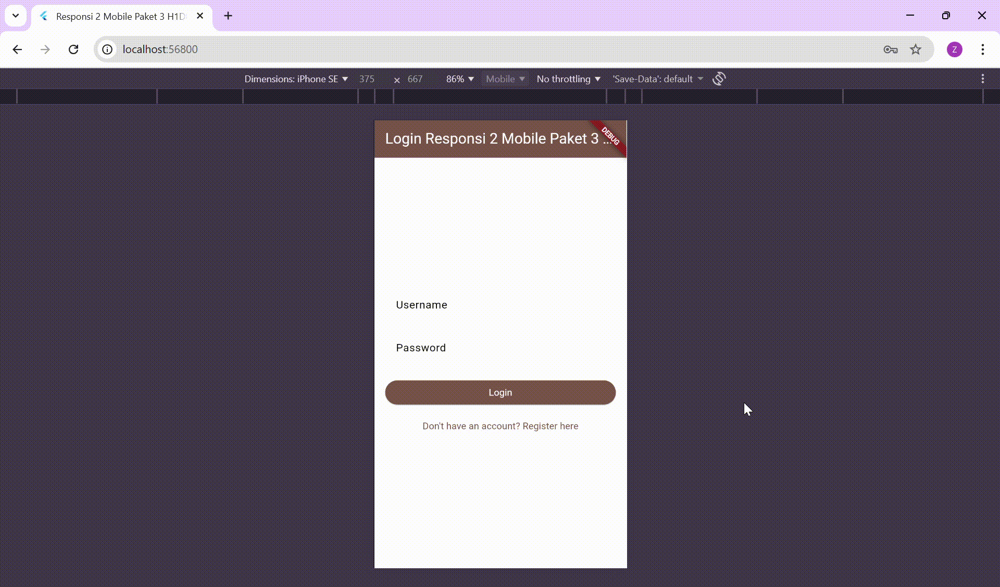

# Responsi 2 Mobile Paket 3 H1D023021

Aplikasi Flutter untuk manajemen inventaris buku dengan backend CodeIgniter 4.

## Informasi Mahasiswa

| Atribut | Nilai |
|---------|-------|
| Nama | Zaizafun Hanifah Zainnur Hanun |
| NIM | H1D023021 |
| Shift Asal | A |
| Shift Baru | C |

## Demo Aplikasi



## Spesifikasi API

Aplikasi ini menggunakan backend CodeIgniter 4 dengan spesifikasi API sebagai berikut:

### Endpoints

#### 1. Registrasi Member
- **Method**: `POST`
- **Endpoint**: `/registrasi`
- **Request Body**:
  ```json
  {
    "username": "string",
    "email": "string",
    "password": "string"
  }
  ```
- **Response**: Token JWT

#### 2. Login Member
- **Method**: `POST`
- **Endpoint**: `/login`
- **Request Body**:
  ```json
  {
    "username": "string",
    "password": "string"
  }
  ```
- **Response**: Token JWT

#### 3. Get All Books
- **Method**: `GET`
- **Endpoint**: `/buku`
- **Headers**: `Authorization: Bearer {token}`
- **Response**:
  ```json
  {
    "status": "success",
    "data": [
      {
        "id": 1,
        "judul": "string",
        "harga": 10000,
        "jumlah": 5,
        "tanggal_masuk": "2025-12-06",
        "volume": 1,
        "penulis": "string",
        "penerbit": "string",
        "created_at": "2025-12-06 10:00:00",
        "updated_at": "2025-12-06 10:00:00"
      }
    ]
  }
  ```

#### 4. Get Book by ID
- **Method**: `GET`
- **Endpoint**: `/buku/{id}`
- **Headers**: `Authorization: Bearer {token}`
- **Response**: Single book object

#### 5. Create Book
- **Method**: `POST`
- **Endpoint**: `/buku`
- **Headers**: `Authorization: Bearer {token}`
- **Request Body**:
  ```json
  {
    "judul": "string",
    "harga": 10000,
    "jumlah": 5,
    "tanggal_masuk": "2025-12-06",
    "volume": 1,
    "penulis": "string",
    "penerbit": "string"
  }
  ```
- **Response**: Created book object

#### 6. Update Book
- **Method**: `PUT`
- **Endpoint**: `/buku/{id}`
- **Headers**: `Authorization: Bearer {token}`
- **Request Body**: Same as create
- **Response**: Updated book object

#### 7. Delete Book
- **Method**: `DELETE`
- **Endpoint**: `/buku/{id}`
- **Headers**: `Authorization: Bearer {token}`
- **Response**: Success message

## Struktur Aplikasi

```
lib/
├── main.dart                 # Entry point aplikasi
├── models/
│   └── book.dart             # Model data buku dan response
├── services/
│   ├── auth_service.dart     # Service untuk autentikasi
│   └── book_service.dart     # Service untuk operasi buku
└── screens/
    ├── login_screen.dart         # Halaman login
    ├── registration_screen.dart  # Halaman registrasi
    ├── book_list_screen.dart     # Halaman list buku
    ├── add_book_screen.dart      # Halaman tambah buku
    ├── update_book_screen.dart   # Halaman update buku
    └── book_detail_screen.dart   # Halaman detail buku
```

## Penjelasan Kode

### 1. main.dart - Entry Point
```dart
void main() {
  runApp(const MyApp());
}

class MyApp extends StatelessWidget {
  const MyApp({super.key});

  @override
  Widget build(BuildContext context) {
    return MaterialApp(
      title: 'Inventaris Buku Zaza',
      theme: ThemeData(
        primarySwatch: Colors.brown,
        scaffoldBackgroundColor: Colors.brown.shade50,
      ),
      home: const AuthWrapper(),
    );
  }
}
```
**Fungsi**: Menjalankan aplikasi dengan tema coklat dan routing otomatis berdasarkan status login.

### 2. AuthWrapper - Authentication Check
```dart
class AuthWrapper extends StatefulWidget {
  const AuthWrapper({super.key});

  @override
  State<AuthWrapper> createState() => _AuthWrapperState();
}

class _AuthWrapperState extends State<AuthWrapper> {
  final AuthService _authService = AuthService();
  bool _isLoading = true;
  bool _isLoggedIn = false;

  @override
  void initState() {
    super.initState();
    _checkLoginStatus();
  }

  Future<void> _checkLoginStatus() async {
    final token = await _authService.getToken();
    setState(() {
      _isLoggedIn = token != null;
      _isLoading = false;
    });
  }

  @override
  Widget build(BuildContext context) {
    if (_isLoading) {
      return const Scaffold(
        body: Center(child: CircularProgressIndicator()),
      );
    }
    return _isLoggedIn ? const BookListScreen() : const LoginScreen();
  }
}
```
**Fungsi**: Mengecek status login dan menampilkan halaman yang sesuai.

### 3. AuthService - Authentication Service
```dart
class AuthService {
  Future<String?> getToken() async {
    // Mengambil token dari SharedPreferences
  }

  Future<void> saveToken(String token) async {
    // Menyimpan token ke SharedPreferences
  }

  Future<void> logout() async {
    // Menghapus token dan logout
  }

  Future<String> getEffectiveBase() async {
    // Mendapatkan base URL API
  }

  Future<BookResponse> login(String username, String password) async {
    // Melakukan login ke API
  }

  Future<BookResponse> register(String username, String email, String password) async {
    // Melakukan registrasi ke API
  }
}
```
**Fungsi**: Menangani autentikasi, penyimpanan token, dan komunikasi dengan API auth.

### 4. BookService - Book Operations Service
```dart
class BookService {
  Future<Map<String, String>> _getHeaders() async {
    // Mendapatkan headers dengan Authorization token
  }

  Future<BookResponse> getBooks() async {
    // Mengambil semua buku dari API
  }

  Future<BookResponse> getBook(int id) async {
    // Mengambil detail buku berdasarkan ID
  }

  Future<BookResponse> createBook(Book book) async {
    // Membuat buku baru
  }

  Future<BookResponse> updateBook(int id, Book book) async {
    // Update buku existing
  }

  Future<BookResponse> deleteBook(int id) async {
    // Hapus buku
  }
}
```
**Fungsi**: Service untuk semua operasi CRUD pada buku dengan penanganan error yang robust.

### 5. Book Model - Data Models
```dart
class Book {
  // Properties: id, judul, harga, jumlah, tanggalMasuk, volume, penulis, penerbit, createdAt, updatedAt

  Book.fromJson(Map<String, dynamic> json) {
    // Parsing dari JSON API dengan handling aman
  }

  Map<String, dynamic> toJson() {
    // Konversi ke JSON untuk dikirim ke API
  }
}

class BookResponse {
  // Properties: status, message, data, singleData

  BookResponse.fromJson(Map<String, dynamic> json) {
    // Parsing response API
  }
}
```
**Fungsi**: Model data untuk buku dan response API dengan parsing yang aman.

### 6. LoginScreen - Login Page
```dart
class _LoginScreenState extends State<LoginScreen> {
  Future<void> _login() async {
    // Validasi form dan login
    final response = await _authService.login(_usernameController.text, _passwordController.text);
    if (response.status == 'success') {
      // Simpan token dan navigate ke BookListScreen
    }
  }
}
```
**Fungsi**: Halaman login dengan form username dan password, validasi, dan navigasi.

### 7. RegistrationScreen - Registration Page
```dart
class _RegistrationScreenState extends State<RegistrationScreen> {
  Future<void> _register() async {
    // Validasi dan registrasi
    final response = await _authService.register(_usernameController.text, _emailController.text, _passwordController.text);
    if (response.status == 'success') {
      // Navigate ke login
    }
  }
}
```
**Fungsi**: Halaman registrasi dengan validasi form dan navigasi ke login setelah berhasil.

### 8. BookListScreen - Main Book List
```dart
class _BookListScreenState extends State<BookListScreen> {
  Future<void> _loadBooks() async {
    // Load daftar buku dari API
  }

  Future<void> _deleteBook(Book book) async {
    // Konfirmasi dan hapus buku
  }
}
```
**Fungsi**: Halaman utama menampilkan list buku dengan fitur refresh, delete, dan navigasi ke detail/add/update.

### 9. AddBookScreen - Add Book Form
```dart
class _AddBookScreenState extends State<AddBookScreen> {
  Future<void> _addBook() async {
    // Validasi form dan tambah buku
    final response = await _bookService.createBook(book);
    if (response.status == 'success') {
      // Show success dan kembali ke list
    }
  }
}
```
**Fungsi**: Form untuk menambah buku baru dengan validasi dan feedback.

### 10. UpdateBookScreen - Update Book Form
```dart
class _UpdateBookScreenState extends State<UpdateBookScreen> {
  Future<void> _updateBook() async {
    // Validasi dan update buku
    final response = await _bookService.updateBook(widget.book.id!, updatedBook);
    if (response.status == 'success') {
      // Show success dan kembali
    }
  }
}
```
**Fungsi**: Form untuk mengupdate buku existing dengan pre-filled data.

### 11. BookDetailScreen - Book Details
```dart
class BookDetailScreen extends StatelessWidget {
  // Menampilkan detail buku dengan layout yang menarik
  Widget _buildDetailRow(IconData icon, String label, String value) {
    // Helper untuk menampilkan baris detail dengan icon
  }
}
```
**Fungsi**: Halaman detail buku dengan tampilan yang informatif dan mudah dibaca.

## Cara Menjalankan

### Backend Setup
```bash
cd ci4_api
composer install
php spark serve
```

### Frontend Setup
```bash
cd flutter_app/responsi_2_mobile_paket_3_h1d023021
flutter pub get
flutter run -d chrome
```

### Database
Import `database.sql` ke MySQL

## Teknologi yang Digunakan

| Komponen | Teknologi |
|----------|-----------|
| Frontend | Flutter, Dart |
| Backend | CodeIgniter 4, PHP |
| Database | MySQL |
| State Management | StatefulWidget |
| HTTP Client | http package |
| Local Storage | SharedPreferences |
